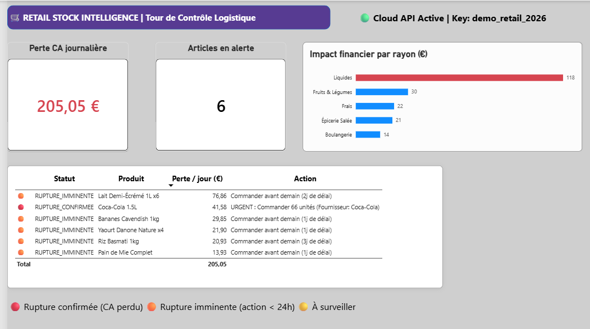

# 🛒 Retail Stock Intelligence API & Dashboard

> Moteur B2B Cloud de détection des ruptures de stock en temps réel et d'estimation des pertes de CA journalières pour la Grande Distribution et le E-commerce.

## 🚀 Live Cloud Demo
- **API Cloud (Swagger Docs) :** https://retail-stock-api.onrender.com/docs
- **Clé API de démonstration :** `demo_retail_2026`

## 📊 Fonctionnalités Métier
- **Calcul de Couverture Dynamique :** Croisement des stocks (magasin + réserve) avec le rythme de vente quotidien.
- **Impact Financier en Temps Réel :** Quantification immédiate des pertes de CA journalières par référence et par rayon.
- **Génération d'Actions Recommandées :** Recommandations de réassort automatique pour les équipes terrain (ex: *"Commander 66 unités avant 11h"*).
- **Architecture Transverse :** API REST Python consommable par n'importe quel outil ERP, Web ou BI (Power BI, Looker).

## 🛠️ Stack Technique
- **Backend & API :** Python 3.11, FastAPI, Pydantic, Uvicorn
- **Sécurité :** Authentification Header (`x-api-key`)
- **Visualisation & Analytics :** Power BI Desktop (Power Query JSON transformation)
- **Cloud & Deployment :** GitHub, Render Cloud Platform
